# Hermes AgentFlow Studio

A modern, responsive web application for the **Hermes AgentFlow Studio**
multi-agent orchestration platform.

Build, deploy, monitor, and chat with autonomous agents from a single,
intelligent control plane.

---

## What is Hermes AgentFlow Studio?

Hermes AgentFlow Studio is the operational cockpit for the Hermes Agent
multi-agent ecosystem. It connects your team to autonomous agents, visual
workflows, real-time task execution, and local or cloud model providers — all
behind a beautiful, dark-themed, production-ready UI.

## Key Selling Points

- **Unified Agent Command Center** — manage agents, tasks, approvals, workflows,
  and chat in one interface.
- **Visual Workflow Designer** — drag-and-drop React Flow canvas with conditional
  branching, Tool and Output blocks, and one-click test runs.
- **Production-Grade Operations** — monitoring, health checks, activity logs, and
  governance toggles built in.
- **Hermes Native Integration** — connect directly to the Hermes Agent API and
  dashboard over Docker networking.
- **Local LLM Support** — chat-test against Ollama, with configurable host and
  model.
- **PWA Ready** — responsive layout and service-worker support for desktop and
  mobile.
- **Docker First** — one-command deploy with `manage.sh` or `manage-containers.sh`.

---

## Product Modules

| Module | Description | Why it matters |
|--------|-------------|----------------|
| **Dashboard** | Live fleet stats, recent running tasks, and agent fleet cards. | Get situational awareness the moment you log in. |
| **Agents** | Create, edit, delete, run, and pause agents. | Manage your agent roster without touching config files. |
| **Workflows** | Visual designer with Start, Agent, Action, Decision, Tool, Output, and End blocks. | Automate multi-step processes with drag-and-drop simplicity. |
| **Tasks** | Create, run, pause, resume, retry, and delete tasks. | Track execution with progress simulation and status filters. |
| **Approvals** | Approve/reject requests and view the decision log. | Keep humans in the loop for risky or sensitive actions. |
| **Automation** | Trigger workflows that create tasks and toggle scheduled runs. | Run recurring or event-driven agent work on a schedule. |
| **Monitor** | Live throughput chart, service health toggle, and activity feed. | Spot problems before they become incidents. |
| **Chat Test** | Send messages to Hermes (`/v1/chat/completions`) and Ollama. | Validate integrations and model behavior in seconds. |
| **Settings** | Hermes API/Gateway, Ollama host, credentials, limits, and URL reachability tests. | Everything needed to wire the studio to your environment. |
| **Logs** | Filtered, chronological activity feed of every application event. | Audit and debug from one place. |
| **Mobile** | Mobile companion for approvals, active tasks, and quick actions. | Operate from anywhere. |

## Ideal For

- **AI engineering teams** orchestrating multiple agents across workflows.
- **Platform operators** who need observability and governance over agent fleets.
- **Product teams** building agent-powered applications on top of Hermes.
- **Developers** testing local and remote LLM integrations from a clean UI.

---

## Operational Flow

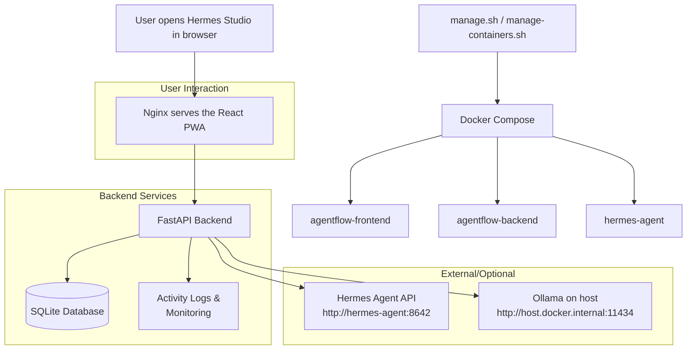

### How a chat request flows

1. User types a message in **Chat Test** and clicks **Send to Hermes**.
2. Frontend posts to `/api/chat` with the Hermes API URL, endpoint,
   username/password, and message.
3. Backend builds the OpenAI-compatible `messages` payload and adds
   `Authorization: Bearer <HERMES_API_SERVER_KEY>`.
4. Backend forwards the request to `http://hermes-agent:8642/v1/chat/completions`.
5. Hermes Agent processes the request and returns a `chat.completion` JSON.
6. Backend extracts the assistant content, model, and token usage and returns
   formatted text to the frontend.

### How a workflow runs

1. User drags blocks onto the **Workflows** canvas.
2. Tool blocks capture a name and code/command.
3. Output blocks store a target result.
4. User clicks **Run**; the backend traces the graph from Start to Output/End.
5. The trace is written to the first Output block and shown in the test output
   panel.
6. User clicks **Save** to persist the workflow, or **Publish** to mark it live.

### How AgentFlow connects to Ollama

1. Ollama is started on the host with `OLLAMA_HOST=0.0.0.0:11434`.
2. AgentFlow backend resolves `host.docker.internal:11434` via the
   `host.docker.internal:host-gateway` mapping.
3. **Chat Test** or **Settings → Ollama Test** POSTs to `/api/ollama` with the
   host and model.
4. Backend calls `http://host.docker.internal:11434/api/generate` and returns
   the model response.

---

## Screenshots

### Dashboard
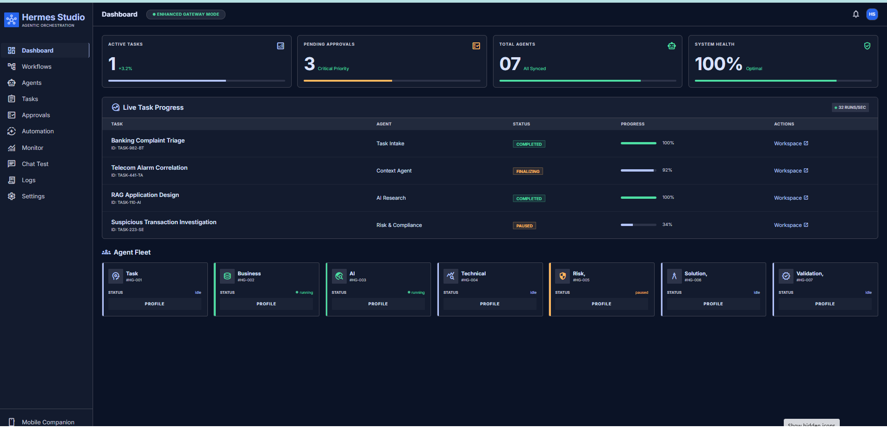

### Agents
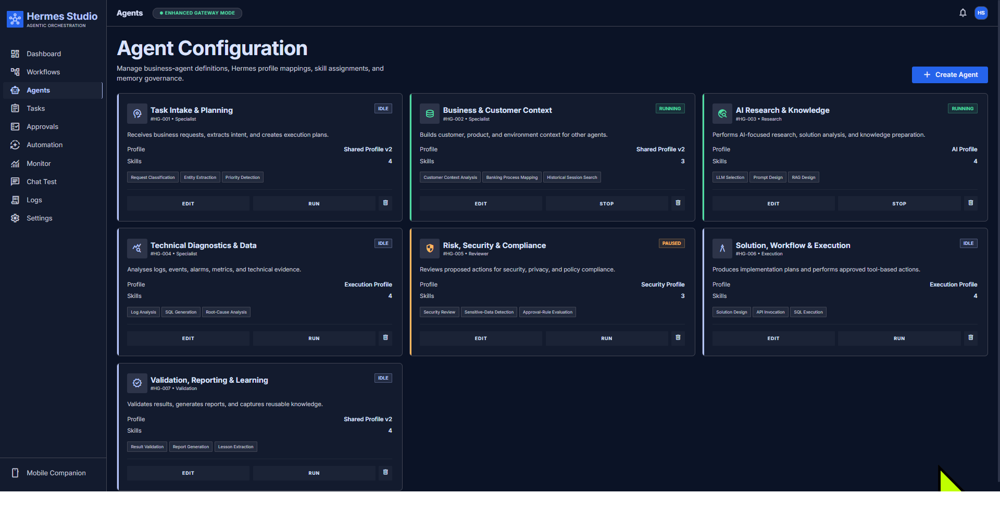

### Workflows
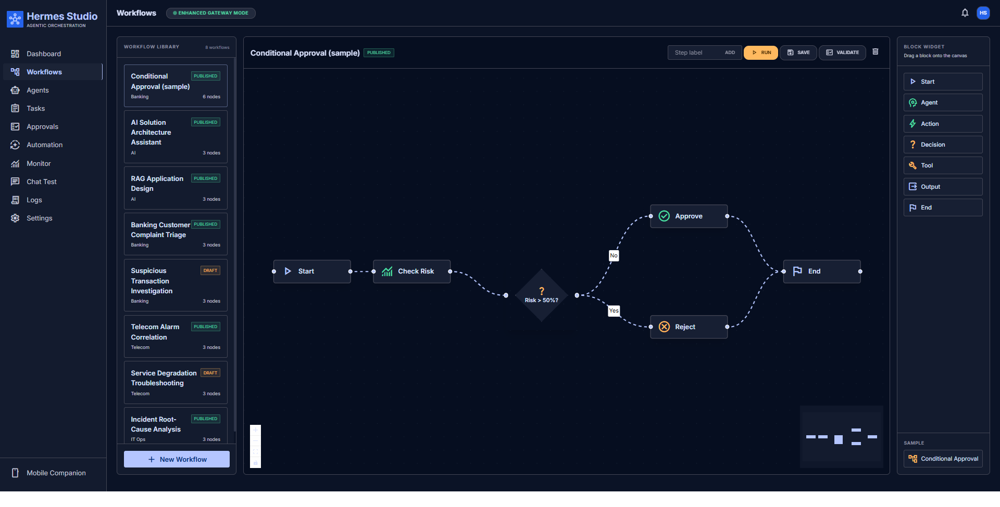

### Tasks
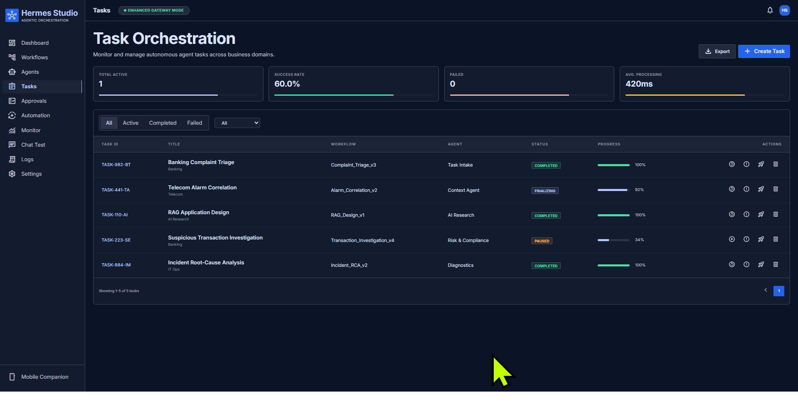

### Approvals
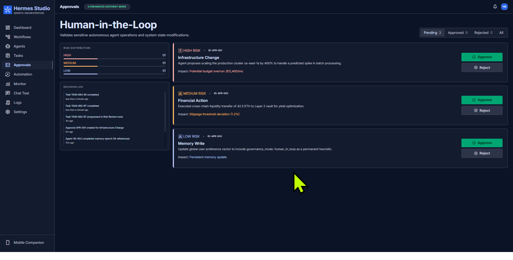

### Automation
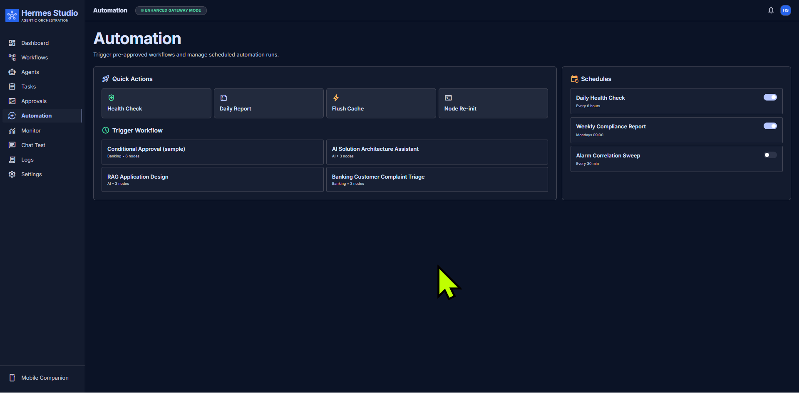

### Monitor
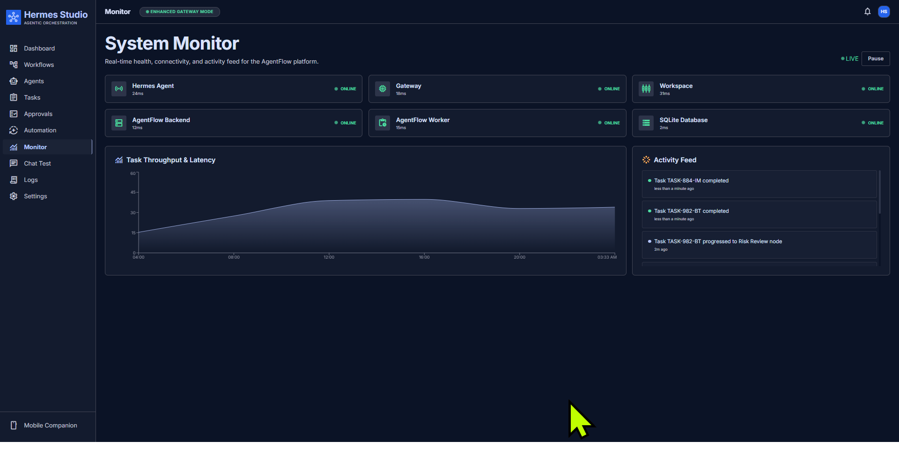

### Chat Test
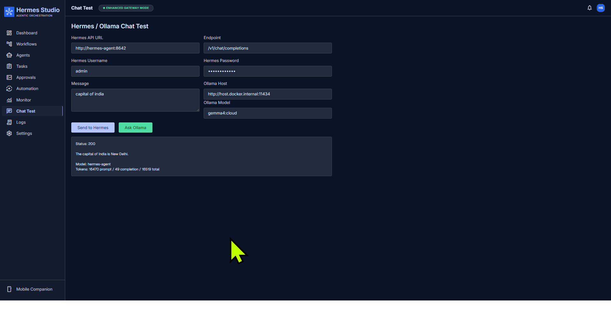

### Settings
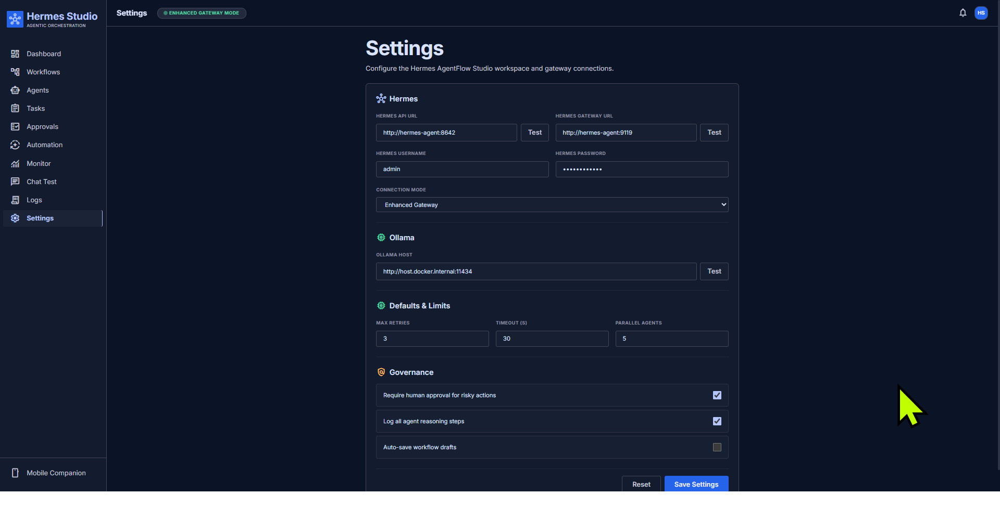

### Logs
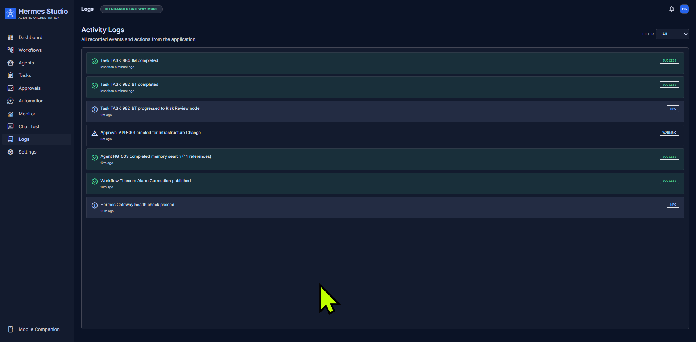

### Mobile Companion
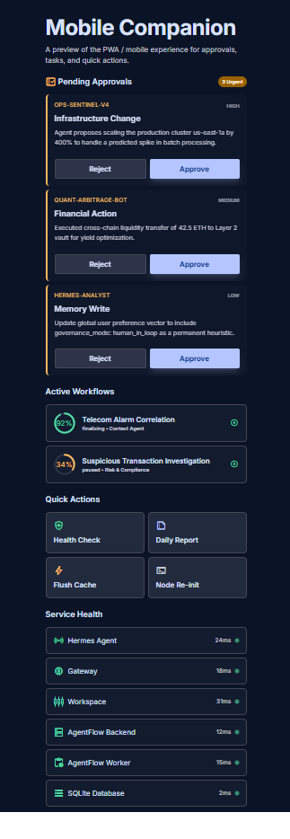

---

## Tech Stack

- Vite + React 18 + TypeScript
- Tailwind CSS with custom design tokens
- React Router
- Zustand (global state + `localStorage` persistence)
- @xyflow/react (workflow designer)
- Recharts (monitoring charts)
- vite-plugin-pwa
- FastAPI + SQLAlchemy (backend)
- Docker Compose

---

## Features in Detail

### Workflow Designer

- Drag-and-drop React Flow canvas.
- Block palette: Start, Agent, Action, Decision, Tool, Output, End.
- Tool blocks with name and command fields.
- Output blocks that display workflow test-run results.
- One-click **Run** to trace the flow and see the output.
- Conditional diamond blocks for branching flows.
- Create, save, publish, and delete workflows.

### Chat Test

- Send messages to Hermes (`/v1/chat/completions`) and Ollama.
- Configurable Hermes API URL, endpoint, username, password, and API key.
- Configurable Ollama host and model.
- Backend normalizes `localhost`/`127.0.0.1` to Docker-friendly addresses.
- Responses are formatted as readable text instead of raw JSON.

### Settings

- Persisted Hermes API URL, Hermes Gateway URL, Hermes username/password,
  Ollama host, limits, and governance toggles.
- **Test** buttons for each URL verify reachability and show the response.

### Activity Logs

- Dedicated `/logs` page showing the full application activity feed.
- Filter by Info, Success, Warning, and Error.

---

## Hermes & Ollama Networking

- AgentFlow backend runs inside Docker.
- Hermes API is exposed on the host at `http://127.0.0.1:8642` and in Docker at
  `http://hermes-agent:8642`.
- Hermes dashboard is exposed on the host at `http://127.0.0.1:9119` and in
  Docker at `http://hermes-agent:9119`.
- Ollama on the host is reachable from Docker via
  `http://host.docker.internal:11434`.
- Start Ollama so Docker can reach it:

  ```bash
  OLLAMA_HOST=0.0.0.0:11434 ollama serve
  ```

- `localhost`/`127.0.0.1` URLs entered in Chat Test/Settings are automatically
  translated to the correct Docker hostnames by the backend.

---

## Quick Start

1. Copy the environment file:

   ```bash
   cp .env.example .env
   ```

2. Fill in `.env`, especially:
   - `HERMES_API_SERVER_KEY` (from the Hermes container).
   - `HERMES_NETWORK` pointing to the Docker network with Hermes.

3. Start Hermes:

   ```bash
   ./manage.sh start-hermes
   ```

4. Start Ollama on all interfaces (optional):

   ```bash
   OLLAMA_HOST=0.0.0.0:11434 ollama serve
   ```

5. Start AgentFlow:

   ```bash
   ./manage.sh start
   ```

6. Open the UI:

   ```text
   http://127.0.0.1:3080
   ```

---

## Management Scripts

Interactive container manager:

```bash
./manage-containers.sh
```

`manage.sh` commands:

```text
./manage.sh deploy        Clone/pull, build and start AgentFlow
./manage.sh start         Start AgentFlow services
./manage.sh stop          Stop AgentFlow services
./manage.sh restart       Restart AgentFlow services
./manage.sh status        Show Docker status and health checks
./manage.sh logs [svc]    Follow logs (optional service name)
./manage.sh shell [svc]   Open a container shell
./manage.sh start-hermes  Start Hermes agent/gateway
./manage.sh stop-hermes   Stop Hermes agent/gateway
./manage.sh backup        Backup SQLite data
./manage.sh restore       Restore SQLite data
./manage.sh prune         Clean Docker images/volumes
```

---

## Troubleshooting

- **Hermes `api_server` cannot bind `127.0.0.1:8642`:**
  Port 8642 is in use. Stop the conflicting process, or change
  `platforms.api_server.port` in Hermes `config.yaml` and restart:

  ```bash
  ./manage.sh stop-hermes
  ./manage.sh start-hermes
  ```

- **Ollama `Connection refused` from Chat Test:**
  Ollama is not running or is bound only to `127.0.0.1`.
  Start it with `OLLAMA_HOST=0.0.0.0:11434`.

- **Hermes chat returns 401 `invalid gateway API key`:**
  Set `HERMES_API_SERVER_KEY` in `.env` to the value shown by
  `docker exec hermes-agent env | grep API_SERVER_KEY`, then recreate the
  AgentFlow backend container.

---

## Notes

- Application state is persisted to `localStorage`; a version migration keeps
  default URLs up to date when they change.
- The SQLite database is stored in `data/agentflow` (mounted into the backend
  container).
- `docker-compose.hermes.yml` is generated by `manage.sh` and is gitignored.
